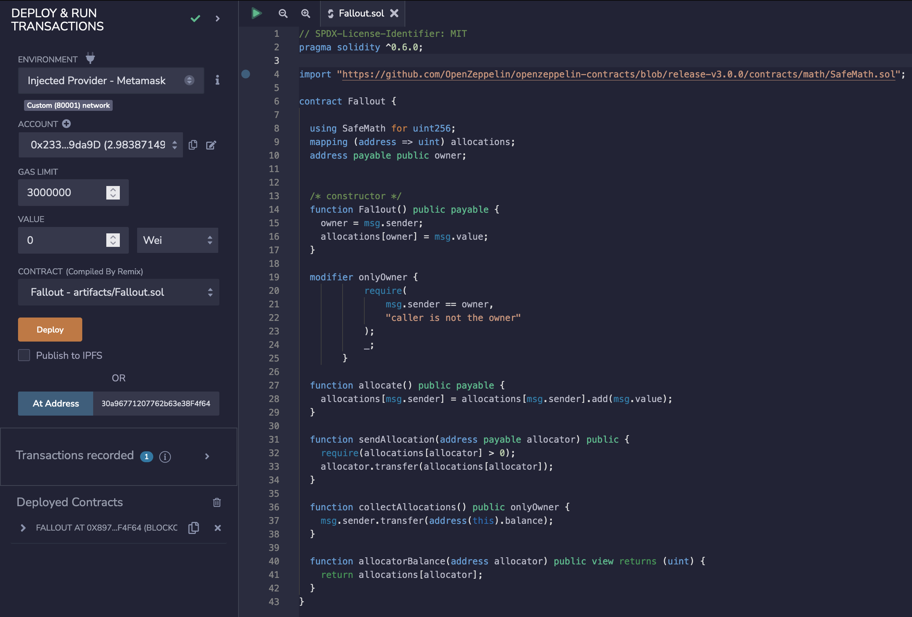
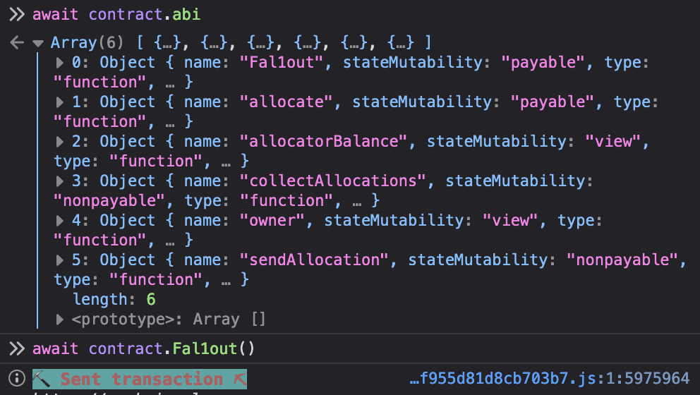

_English version down below_

# Contract

# Solución

### Para batir este nivel debemos conseguir:

    - Reclamar el ownership del contrato.

## Para encontrar la solución, primero debemos conocer el problema

Hasta la vesión 0.4.21 de Solidity, el constructor (función que se ejecuta una sola vez cuando el contrato es desplegado) se definía como una función con el mismo nombre que el contrato, esto hacía que no fuese posible llamar a está función una vez el contrato había sido desplegado.

Esto causó bastantes problemas de seguridad, ya que, si por cualquier razón se cambiaba el nombre del contrato, el método (función) que antes funcionaba como constructor, dejaba de hacerlo y comenzaba a funcionar como un método normal, lo que permitia llamarlo aunque el contrato ya hubiese sido desplegado.

Este es exactamente el problema de este nivel, podemos ver que el nombre de la fución _Fal1out()_ comentada como _/* constructor */_ es lévemente diferente al nombre del contrato.

	contract Fallout {
-----------------------------
	/* constructor */
	function Fal1out() public payable {
		owner = msg.sender;
		allocations[owner] = msg.value;
	}

Esto nos permite llamar a la función y obtener el ownership.

CONSEJO: Podemos consultar el ABI del contrato y llamar a las funciones directamente desde la consola del navegador.

----------
----------

# Solution

### To beat this level we must achieve:

    - Claim ownership of the contract.

## To find the solution, we must first know the problem.

Until Solidity version 0.4.21, the constructor (function that is executed only once when the contract is deployed) was defined as function with the same name as the contract, so it was not possible to call this function once the contract had been deployed.

This caused quite a few security problems, since, if for any reason the name of the contract was changed, the function that previously worked as a constructor, stopped working as a constructor and started working as a normal one, allowing to call it even if the contract had already been deployed.

This is exactly the problem at this level, we can see that the _Fal1out()_ function commented as _/* constructor */_ is slightly different from the name of the contract.

	contract Fallout {
-----------------------------
	/* constructor */
	function Fal1out() public payable {
		owner = msg.sender;
		allocations[owner] = msg.value;
	}

This allows us to call the function and get the ownership.

TIP: We can check the ABI of the contract and call the functions directly from the browser console.

